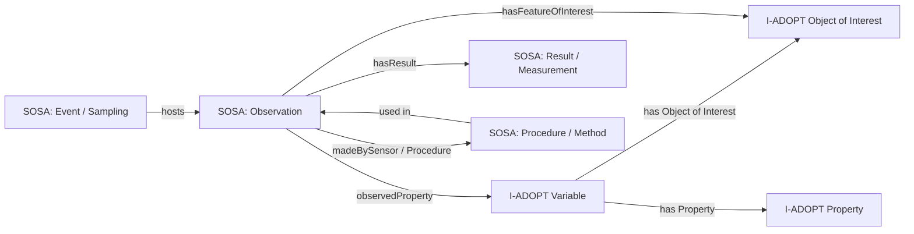

## Dataset modeling approach (next step)

We currently have **two datasets decomposed and mapped in one large diagram**. It’s useful but too complex to maintain. Our next step is to **split the model by sub‑components** and build each module independently—starting with **entities / objects of interest**.

### Why this approach

- Reduces complexity and makes reviews tractable
- Lets different contributors focus on their specialty
- Produces smaller modules that can be composed later

## Sub‑components to model

### 1) Entities / Objects of Interest (start here)

- Salmon life stages (juvenile, smolt, adult)
- Demographic units (population, CU, stock)
- Sampling units (site, station, survey)
- Physical specimens and collections

**Outputs:** entity taxonomy, labels, and mappings to **SOSA + I‑ADOPT ObjectOfInterest**.

### 2) Variables

- Define “what is being observed” as a **composed variable**
- Example: “juvenile sockeye fork length at ocean entry”

**Outputs:** variable templates, decomposition into **I‑ADOPT components**, links to methods.

### 3) Properties

- The measurable characteristic (length, weight, condition factor)
- Standardized naming + QUDT units

**Outputs:** property vocabulary + constraints.

### 4) Events & Activities

- Sampling events, surveys, capture/recapture
- Observation events in **SOSA**

**Outputs:** event classes + relationships to entities and methods.

### 5) Methods & Protocols

- Measurement methods (otoliths, scales, gear type)
- Protocol identifiers and provenance links

**Outputs:** methods vocabulary + provenance templates.

## Suggested order of work

1. **Entities** (objects of interest)
2. **Properties** (what is measured)
3. **Variables** (compose object + property + constraints)
4. **Events** (observation/sampling context)
5. **Methods** (procedures and provenance)

We’ll then **re‑compose** the modules into a single integrated model.

---

## Simple alignment diagram (SOSA + I‑ADOPT)

