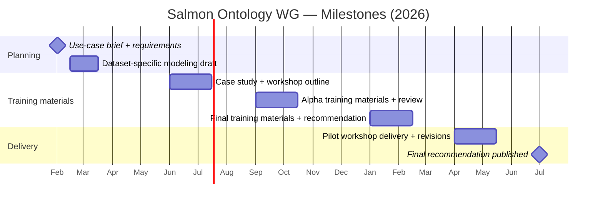

import { Card, CardGrid } from '@astrojs/starlight/components';

## Overview

The Salmon Ontology Hub is the documentation and coordination home for the **Salmon Domain Ontology** and its supporting working group. We’re building shared vocabulary and ontology modules so salmon datasets can be compared, integrated, and reused across organizations and regions.

## Working group

We are the **Salmon Ontology Development Working Group**, operating under the **Research Data Alliance (RDA) Salmon Monitoring & Research Interest Group**.

## Why this matters

Salmon data are fragmented across agencies, programs, and methods. Without shared terms and definitions, integration is slow, costly, and error-prone. This hub provides the community process and artifacts needed to align data for analytics, decision support, and AI-ready workflows.

## Where we’re at (status)

Our latest working group cycle is focused on the following actions:

- **Upper ontology alignment:** confirm the alignment framework (SOSA, OBOE, I-ADOPT) and define how we represent entities, measurements, methods, and events.
- **Module breakdown:** decompose the Hakai v. Neville schema diagram into smaller, theme-based ontology modules.
- **Rules for automation:** draft a rule set for LLM-assisted ontology module creation (entities, measurements, methods, events).
- **Module wiring:** identify how individual modules connect and where shared definitions live.

## Quick navigation

<CardGrid stagger>
  <Card title="Alignment framework" icon="open-book">
    Upper‑level ontology alignment meta‑framework and rules of thumb.
  </Card>
  <Card title="Dataset modeling" icon="pencil">
    How we decompose datasets into entities, variables, properties, events, and methods.
  </Card>
  <Card title="Working group" icon="users">
    Read how the WG operates and how to engage.
  </Card>
  <Card title="Resources" icon="link">
    Workshop materials, references, and key links.
  </Card>
</CardGrid>

## Milestones (Gantt)

